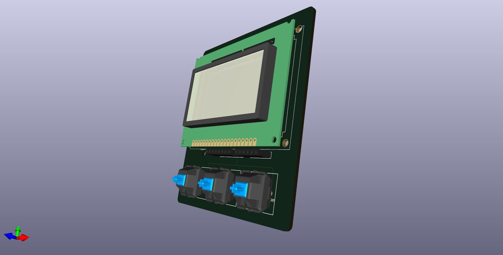
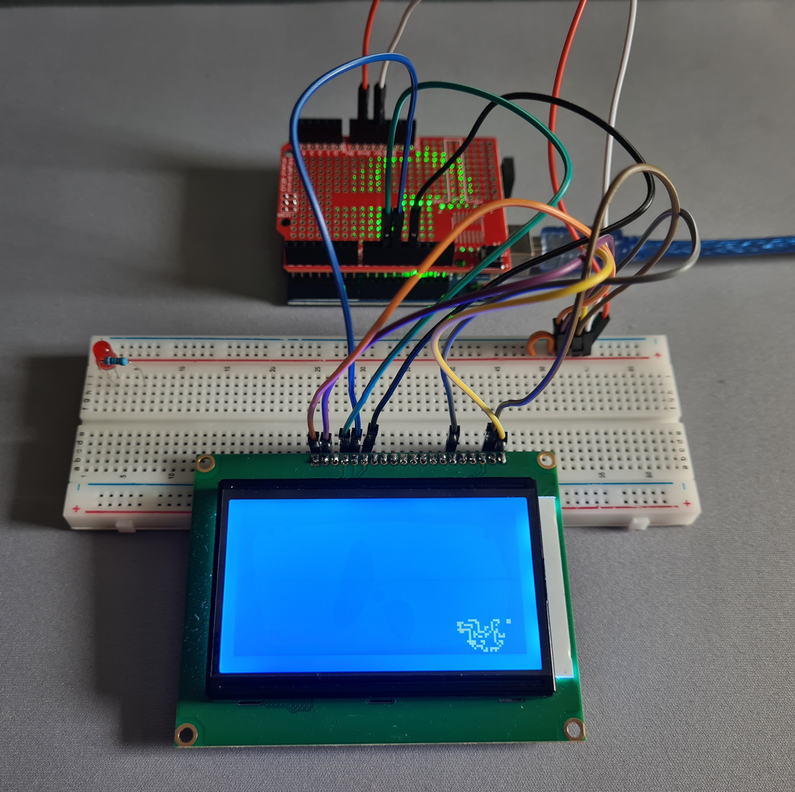
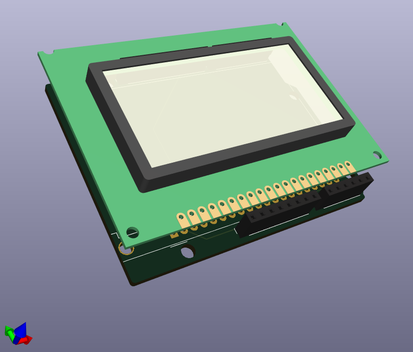
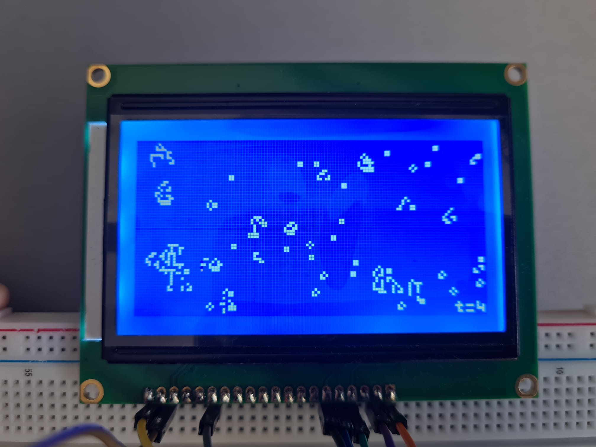
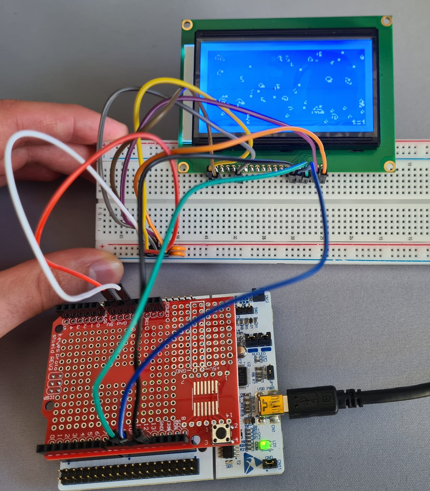
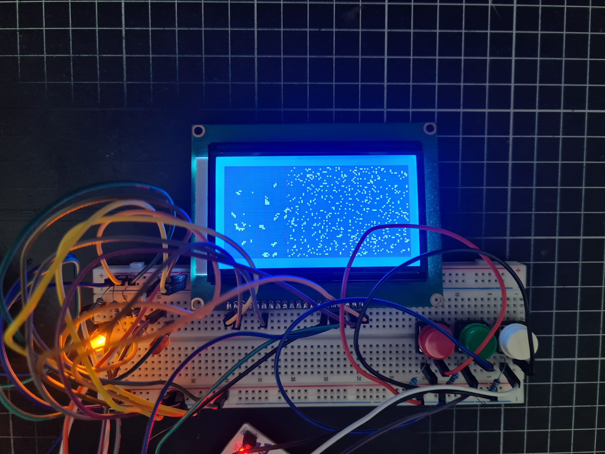
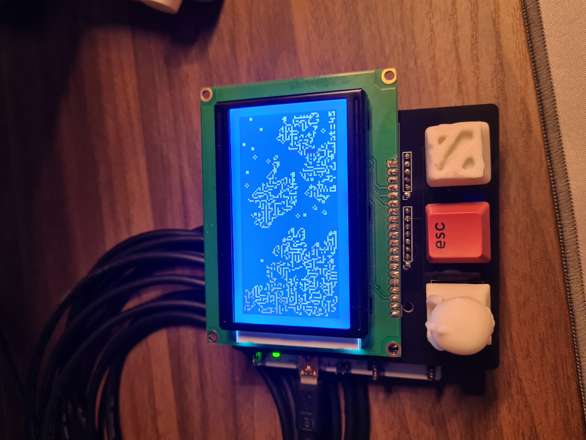

# conway
Using my own implementation of Conway's game of life to learn more about embedded software.

# Notes to the weary traveler
- If you want to repeat this project, first order your cherry MX keys, then check the PCB layout.
  For me, the connector pins were on different locations than the schematic file I got. Update this afterwards.
- It is extremely unlikely that your LCD will have the same pinouts as mine, double check this part.
- My LCD's pins aren't in the middle of the PCB (Check the final image), if you care about this, you might want
  to adjust the location of the pins so the buttons are neatly aligned under the screen.

## Goal/Overview

- The PCB itself is supposed to just be a nice bit of desk decoration. It can all be powered
from a USB cable, connected to the STM. 
- Started out with a basic design to perpetually render Conway's game of life on an LCD
screen. Naturally scope creep ensued:
    - Made a custom PCB for mounting the screen and connecting to it.
    - Added buttons and LEDs for different rules to use.
    - Figured keyboard keys would work quite well for this. Updated PCB accordingly
- Wound up with a relatively useful shield that can be repurposed for future projects.



First version:
<details>
<summary> Initial breadboard layout</summary>



</details>


### Arduino support
The standard Arduino Uno does not have enough on-board memory to support a 128x64 pixel display.
In my case, pictured above, I wanted to release a version of this code that works easily for the average user.
Hence reducing the screen size to 64x36 is the largest section that we can run with a simple approach to Conway's game of life.

### Python demo
The software for Conway's game of life, for a basic python version and Arduino can be found in `/software`.

### LCD Screen config
The U8G2 Arduino library has a large amount of support for LCD screens, available [here](https://github.com/olikraus/u8g2/wiki/u8g2setupcpp). I used the `ST7920_128X64` module.

Refer to the LCD datasheet in `/circuitry` for wiring.

### STM Nucleo
On an STM32 NULCEO-F411RE, with more memory, the full 128x64 LCD screen is easily rendered.
I have made a shield that the screen can connect to directly using kicad 7. 
These files can be found under `/circuitry/kicad`. 

Install the Arduino library, then STM Core library from [here](https://github.com/stm32duino/Arduino_Core_STM32).

Great documentation on installing STM support [here](https://github.com/stm32duino/Arduino_Core_STM32/wiki/Getting-Started).

Summary of above STM install:

Install the STM Cube programmer software (required), from [here](https://www.st.com/en/development-tools/stm32cubeprog.html#get-software).
You will need to check your email for the download link to the above.

You can go to File -> Preferences -> Additional boards manager URLs, paste the link in the above documentation here.

Then click the Boards Manager icon, type "STM", then install "STM32 MCU based boards".

We can now go to "Select Board" --> Easiest to connect the STM to your PC and check its name. For me, I selected Nucleo-64.

Make sure you additionally select the correct board part number! This caught me out initially. This is in the "Tools" drop-down menu.
You can plug in your STM to your PC and open the `MBED` file, which opens a webpage with details on the model number and so-on.
If you don't have network access, your board should show up with the part number as its name as a drive in your PC.

Finally, the code uses the U8g2lib, which can be installed with: Library Manager --> search "U8g2", install first result.

<details>
<summary> First, basic layout</summary>



Example wiring.
Barebones only display updating is in `conway_stm64.ino` for full display and a counter of generations.





</details>

#### Adding buttons

Additionally, buttons and LEDs were added so the user can choose different rulesets to use
for Conway's game of life. Pictured below is the "white" LED shining from selecting the
Morley's miracle rules, by clicking the white button.



We now also have a more elegant PCB with support for Cherry MX keys:
I found [these](https://www.digikey.co.nz/en/products/detail/cherry-americas-llc/MX1A-E1NW/20180) 
on Digikey that had nice 3D files. This yielded the screenshot in the Overview section.

## Final PCB with screen:



### TODO:
Hardware:
- Make a 3D-printed case for this, done on onshape, the .stl will be added in `/enclosure`.
- Keycaps are stupdidly expensive on Digikey, at $9 each. I should 3D print some, will also add to above folder.

Software:
- Add support for the cherry keys as they don't have resistors. See [here](https://docs.arduino.cc/tutorials/generic/digital-input-pullup/).
- Add in a button press combination to restart the simulation.
- Weird bug where pulling the power on the card fills the screen with chinese characters? Doing a reset loads graphics properly.
      - Honestly this is pretty funny so might not try to diagnose.

Reference file structure:
```
.
├── circuitry
├── enclosure
├── img
└── software
```
