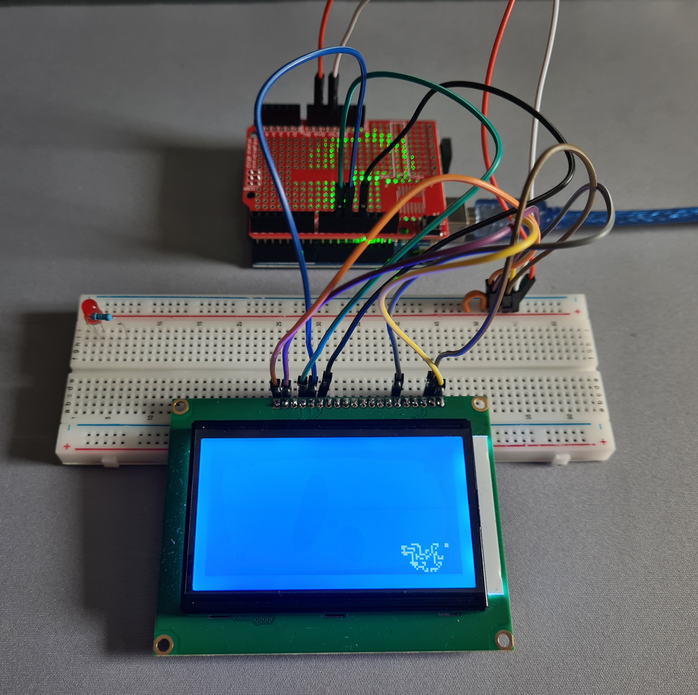

# conway
Using my own implementation of Conway's game of life to learn more about embedded software.

The standard Arduino Uno does not have enough on-board memory to support a 128*64 pixel display.
In my case, pictured above, I wanted to release a version of this code that works easily for the average user.
Hence reducing the screen size to 64*36 is the largest section that we can run with a simple approach to Conway's game of life.

I'll also attach a wiring diagram for those that want to get a quick setup working.

My extension project is running this on an STM32 NULCEO-F411RE. This has enough memory and I plan to also make a 3D-printed case for this.
The design for the 3D-printed case will be done on onshape, the .stl will be added here.
This will be powered with a 5V input and I want to design my own circuit board in KiCad. While excessive, this is purely for learning.
