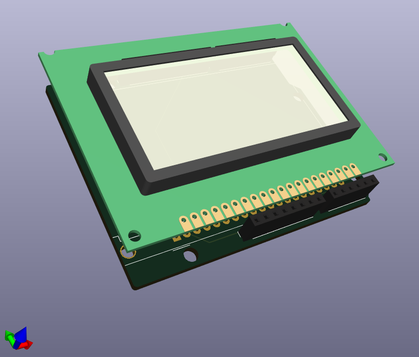

# conway
Using my own implementation of Conway's game of life to learn more about embedded software.


The standard Arduino Uno does not have enough on-board memory to support a 128x64 pixel display.
In my case, pictured above, I wanted to release a version of this code that works easily for the average user.
Hence reducing the screen size to 64x36 is the largest section that we can run with a simple approach to Conway's game of life.
The software for Conway's game of life, for a basic python version and Arduino can be found in `/software`.
The U8G2 Arduino library has a large amount of support for LCD screens, available [here](https://github.com/olikraus/u8g2/wiki/u8g2setupcpp). I used the `ST7920_128X64` module.

Refer to the LCD datasheet in `/circuitry` for wiring.

My extension project is running this on an STM32 NULCEO-F411RE. This has enough memory for the entire screen. I have made a shield that the screen can connect to directly using kicad 7. These files can be found under `/circuitry/kicad`. Here is the finished 3D model:




I plan to also make a 3D-printed case for this, done on onshape, the .stl will be added in `/enclosure`.
This will be powered with a 5V input and I want to design my own circuit board in KiCad. While excessive, this is purely for learning.

Reference file structure:
```
.
├── circuitry
├── enclosure
└── software
```
